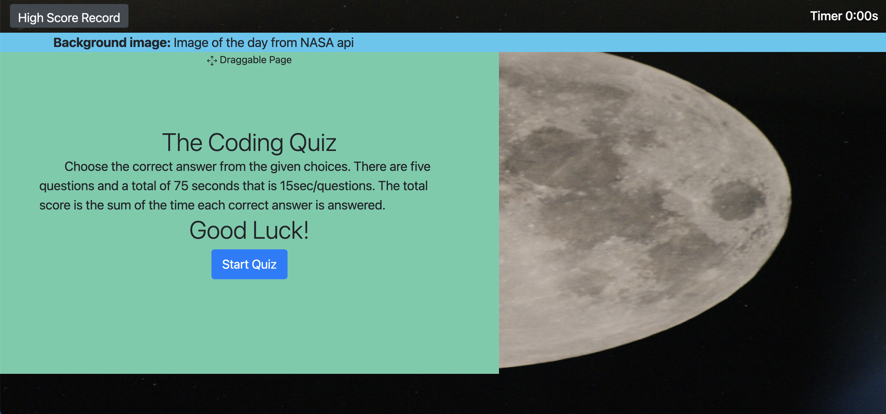
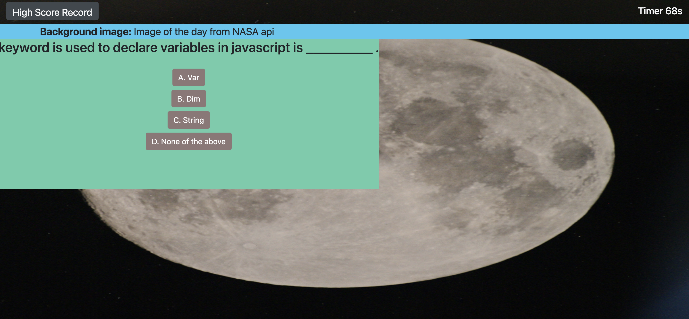
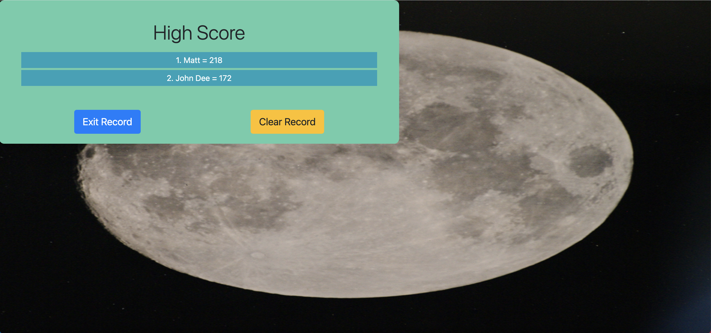

# Code-Quiz

In this quiz code project, I have developed an apllication for taking timed quiz with multiple-choice questions. An `index.html`, `style.css`, and `script.js`' and screen shoot `image` are included in this repository.

## Instruction

1. In the first page there are two buttons. the High Score record button will take you to check high score recored and the Start Quiz button will take you to the multiple choice questions.
   

2. Onece the start quiz button is clicked, timer starts counting and the questions with clickable choices are displayed, and if a choice is clicked a correct or wrong notification is desplayed and proced to the next question.
   

3. If all questions are answered in the given time or time is over the final score will be desplayed and write your initial page is desplayed.
   

4. Finally the score is recorded in descending order where the highst score is desplayed at the top.
   

## Contributor

[Berhane Beyene](https://github.com/Bbeyenene)

## Deployed

URL: [code quiz](https://bbeyenene.github.io/Code-Quize/)
